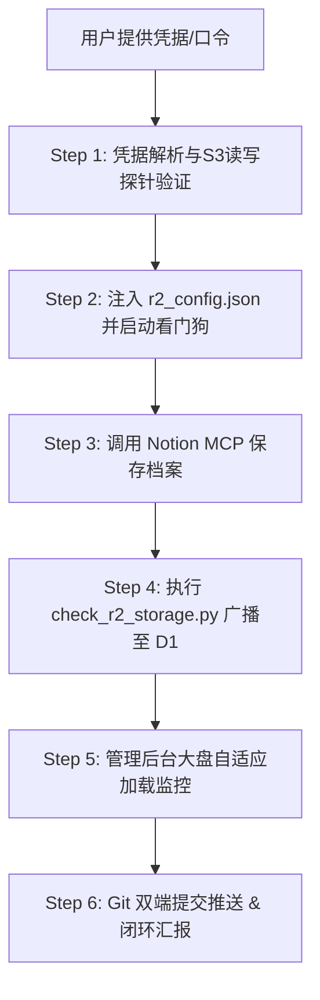

# Cloudflare R2 新存储桶全生命周期一键入网 Skill (R2 Bucket Onboarding)

本文档定义了当音信（MoodyMusic）接入新 Cloudflare R2 存储桶（如第 17 桶、第 18 桶及后续任意扩展桶）时的全流程标准作业程序（SOP）。
目标是实现**用户仅需一句口令并提供凭据，Agent 全自动完成「S3验证 -> 配置注入 -> 看门狗接入 -> 保存至Notion -> 管理后台添加监控 -> 生产同步」全闭环**。

---

## 🏛️ 一、核心物理铁律 (First Principles)

1. **商业十进制计费标准**：
   - 严格遵循 Cloudflare 商业计费标准：`1 GB = 1,000,000,000 字节`。
   - **9.00 GB 自动封箱预警线**：一旦达到 9.00 GB（90%），系统全自动封箱切为只读。
   - **9.50 GB 红色绝对熔断线**：死守 10.00 GB 免费额度底线，绝对杜绝产生任何超额账单。
2. **底层写前看门狗自动接管**：
   - 新桶一旦接入，系统全局 Python `moody_r2_physical_guard.py` 会动态感知该桶水位。
   - 内存累加器实时追踪写入增量，单次采录或大批量迁移若即将达到 9.00 GB，在发包前 0 毫秒强制阻断并自动故障转移（Failover），完全零人工介入。
3. **绝对 CDN 直链铁律**：
   - 新桶必须配置公开 CDN 域名（如 `https://pub-xxxx.r2.dev`），杜绝任何相对路径。

---

## 🚀 二、6 步标准化接入流水线 (SOP)

当用户提出接入新桶诉求时，严格执行以下 6 步自动化流水线：



---

### Step 1: 凭据捕获与 S3 读写探针测试
用户可直接在对话框粘贴 Cloudflare 控制台复制的凭据块，包含：
- 邮箱、桶名称（如 `moody-music-asset-17`）、Account ID（32位）、S3 Endpoint、CDN 域名（`pub-xxx.r2.dev`）、API Token（`cfat_...`）、Access Key ID（32位）、Secret Access Key（64位）。

**自动化执行**：
运行内置入网校验工具：
```powershell
python backend/scripts/add_r2_bucket.py --name <桶名> --email <邮箱> --account_id <AccountID> --access_key <AK> --secret_key <SK> --public_domain <CDN域名> --api_token <Token>
```
*注：也支持 `python backend/scripts/add_r2_bucket.py --paste` 交互式整段文本粘贴。*

**探针测试逻辑**：
1. `list_objects_v2`：测算初始物理对象数与容量；
2. 连通性校验通过后继续下一步；若失败立即阻断并向用户指出具体错误凭证。

---

### Step 2: 配置文件注入与看门狗自动挂载
1. 脚本自动在 [`backend/r2_config.json`](file:///e:/Workspace/AI-Project/MoodyMusic-Workspace/backend/r2_config.json) 的 `buckets` 中生成 `account_XX` 节点；
2. 若初始用量 $< 9.00\text{ GB}$，自动配置：
   ```json
   "status": "standby",
   "allow_writes": true,
   "max_safe_gb": 9.5
   ```
   若当前主力桶已满或无可用主力桶，自动将新桶晋升为 `"status": "active_write"`；
3. **全局自愈看门狗自动接管**：
   - Python 底层网络看门狗（`moody_r2_physical_guard.py`）自动读取配置；
   - 只要进程累计写入使该桶达到 9.00 GB，底层 0 毫秒拦截、自动切为 `sealed_readonly` 并轮转新桶。

---

### Step 3: 持久化保存至 Notion 知识库
使用 `notion-mcp-server` 将新桶凭证规范归档至全局知识库：
- **目标页面**：`MOODY 音乐档案项目 (ClawCloud + R2)`
- **页面 ID**：`324840be-9e1a-8166-8c88-cd42c70c33a7`
- **操作方式**：调用 `call_mcp_tool` -> `API-patch-block-children` 追加 Callout / Table 记录：
  - 格式规范：
    - 存储桶：`moody-music-asset-XX` (Bucket XX)
    - Google 账号：`<email>`
    - Account ID：`<account_id>`
    - S3 Endpoint：`https://<account_id>.r2.cloudflarestorage.com`
    - 公开 CDN 域名：`https://pub-xxxx.r2.dev`
    - API Token：`cfat_...`
    - R2 访问密钥：AK: `<access_key_id>` / SK: `<secret_access_key>`

---

### Step 4: 执行自适应集群监控并广播至 D1
执行自适应集群容量核算脚本：
```powershell
python backend/scripts/check_r2_storage.py
```
- 自动识别新增的第 XX 桶；
- 刷新全集群总配额（扩展为 `N × 10.00 GB`）；
- 自动向 Cloudflare D1 `app_settings` 写入最新指标，全网 Worker 与管理后台秒级生效；
- 自动同步更新 4 处 `r2_stats.json` 缓存。

---

### Step 5: 验证 Web 管理后台自适应监控
- 管理后台 [`MoodyMusic-Web/admin/admin.js`](file:///e:/Workspace/AI-Project/MoodyMusic-Workspace/MoodyMusic-Web/admin/admin.js) 已内置动态自适应渲染引擎；
- 当读取到大盘 JSON 中的 `bucketXX` 时，自动在 `#r2-buckets-grid` 网格中动态生成对应的 SVG 环形仪表盘卡片与容量百分比徽章，无需手工改动静态 HTML！

---

### Step 6: 双端代码提交与生产同步
自动将变更提交并推送到 GitHub 远程仓库：
1. **服务端 (MoodyMusic-Server)**：
   ```powershell
   git add backend/r2_config.json backend/frontend/admin/r2_stats.json backend/frontend/r2_stats.json
   git commit -m "feat(r2-cluster): onboard bucket XX (moody-music-asset-XX) with automated safeguards"
   git push origin main
   ```
2. **网页端 (MoodyMusic-Web)**：
   ```powershell
   git add admin/r2_stats.json r2_stats.json admin/admin.js
   git commit -m "chore(stats): update cluster monitoring for bucket XX"
   git push origin main
   ```

---

## 📋 三、执行完毕输出模板

全部步骤完成后，向用户输出结构化汇报：
```markdown
### 🎉 Cloudflare R2 第 XX 存储桶已成功入网并启用全自动防御！

1. **物理连通性验证**：
   - 存储桶名称：`moody-music-asset-XX`
   - S3 握手测试：✅ 通过
   - 初始容量：`0.00 GB / 10.00 GB` (0 对象)
2. **集群角色与安全策略**：
   - 初始状态：`🚀 主力写入中` 或 `🟢 就绪待命`
   - 自动防御水线：**9.00 GB 自动封箱 / 9.50 GB 物理熔断**
   - 看门狗状态：全局 Python 钩子与 Worker 网关已全自动挂载守护
3. **Notion 知识库归档**：
   - 已同步追加至：[MOODY 音乐档案项目 (ClawCloud + R2)](https://notion.so/324840be9e1a81668c88cd42c70c33a7)
4. **管理后台大盘监控**：
   - 集群总容量：扩展至 `XX0.00 GB`
   - 管理后台地址：`https://admin.changgepd.ccwu.cc`（卡片已动态挂载）
5. **代码仓库同步**：
   - MoodyMusic-Server & MoodyMusic-Web GitHub main 分支已双端推送生效！
```
