# 🎵 MOODY — 私人音乐档案库 V2

> 专为同学录场景设计的私有音乐流媒体系统。仅限受邀成员访问，通过「座位认领」方式完成注册。

[](https://github.com/zhangjing02/MOODY-Music-Archiv-V2/actions)

## Data Platform Plan (2026-04)

### 1. Goals

- Keep audio assets (songs / lyrics / covers) stable and cost-efficient.
- Make business data easier to operate, query, and migrate in the future.
- Preserve production stability during transition (no big-bang rewrite).
- Keep mobile and frontend contracts stable (`code/message/data` + consistent seat code).

### 2. Current Baseline

- `Cloudflare R2`: audio/media files (large objects).
- `Cloudflare D1`: core business metadata (artists, albums, songs, roster).
- `Supabase Auth`: account identity, JWT/session lifecycle.
- `Cloudflare Worker`: unified API gateway and business orchestration.

This baseline remains valid and should not be disrupted in one shot.

### 3. Data Placement Strategy

#### 3.1 Keep In Cloudflare

- Large files: songs (`.mp3`), lyrics (`.lrc`), covers.
- Edge-hot metadata that serves playback path resolution.
- Data requiring low-latency Worker-local reads.

#### 3.2 Move/Build In Supabase

- Social domain: posts, comments, likes, reports, moderation logs.
- Optional non-playback business data needing richer SQL/admin tooling.
- Continue using Supabase as identity source.

#### 3.3 Hybrid Principle

- R2 remains file source of truth.
- Supabase is social/business source of truth (where suitable).
- D1 can remain edge cache/read model for high-frequency APIs.
- Worker remains the only public API boundary.

---

## 🚨【系统最高铁律】音频与歌词存储路径规范：严禁写入相对路径！

> **⚠️ 严重警告（CRITICAL ARCHITECTURE REQUIREMENT - 2026-09-19 全体开发与 AI 必读）**：
> **自 2026-09-19 起，所有采录下载、清洗补全与点亮脚本向 Cloudflare D1 数据库写入的 `file_path` 与 `lrc_path` 必须 100% 存储为带域名的【绝对 CDN 直链】（例如 `https://pub-a0a90fda9b0d45d59a52685eb2ee93d6.r2.dev/music/...`），绝对严禁写入 `music/...` 或 `lyrics/...` 这种相对路径！**

### 1. 为什么绝对不能存相对路径？（客户端架构致命原理剖析）
客户端（Android ExoPlayer 与 Web 前端）底层对音频 URL 的解析逻辑如下：
1. **绝对直链判定**：客户端仅当检测到路径以 `http://` 或 `https://` 开头时，才直接连接 Cloudflare R2 公网 CDN 边缘节点极速起播。
2. **相对路径解析陷阱**：若数据库下发的是相对路径（如 `music/零点乐队/别误会/s_28720.mp3`），客户端会依据默认策略拼接为 Worker 网关地址：
   `https://m-api.changgepd.ccwu.cc/storage/music/零点乐队/别误会/s_28720.mp3`
3. **致命 404 与无限卡死**：
   - Cloudflare Worker 内部的 `/storage/*` 代理**仅绑定了最早的第 1 存储桶（moody-music-asset，55GB 只读）**；
   - 第 2~8 号存储桶根本没有挂载到 Worker 代理中，因此向 Worker 请求第 7 桶或第 8 桶的文件直接报 **HTTP 404 Not Found**！
   - 随后客户端触发硬编码的容灾逻辑，将域名替换为第 2 桶（`pub-9ea7ff16...`），再次报 **404 Not Found**！
   - ExoPlayer 连续收到 404 后陷入无限重试与 Buffering 缓冲挂起，**导致前端 App 界面表现为“一直在转圈加载、永远无法播放”**！

### 2. 标准规范写入公式（所有后续开发与公司 AI 必须严格遵守）
在调用 `/api/admin/songs/batch-light` 提交更新前，必须动态获取目标存储桶的公网直链域名 `public_domain`，并拼接成完整 URL：
```python
# 1. 获取目标桶的公网直链域名 (去除末尾斜杠)
cdn_domain = target_bucket_cfg.get("public_domain", "").rstrip('/')

# 2. 绝对直链标准化格式
abs_mp3_url = f"{cdn_domain}/{r2_audio_key}"
abs_lrc_url = f"{cdn_domain}/{r2_lrc_key}" if has_lrc else None

# 3. 向 D1 提交点亮 (必须确保传入的是完整的 https:// 链接)
payload = {
    "updates": [
        {
            "id": song_id,
            "file_path": abs_mp3_url, # 必须是 https://pub-xxxx.r2.dev/music/...
            "lrc_path": abs_lrc_url   # 必须是 https://pub-xxxx.r2.dev/lyrics/... (或 None)
        }
    ]
}
```

---

## 🚨【系统最高铁律二】Cloudflare D1 数据库配额安全防线：严禁全库扫表（Row Reads 防熔断准则）

> **⚠️ 严重警告（CRITICAL DATABASE SAFETY REQUIREMENT - 2026-09-20 全体开发与 AI 必读）**：
> **自 2026-09-20 起，所有后端接口、自动化脚本、数据清洗与采录维护程序，严禁执行任何形式的“无条件全表扫描”（如 `SELECT ... FROM songs WHERE 1=1` 无针对性过滤），严禁在生产和测试环境中保留无参全量曲库接口！**

### 1. 血泪教训复盘（2026-09-20 D1 全库硬熔断瘫痪事件）
- **官方配额硬约束**：Cloudflare 自 2026 年 9 月 1 日起，对 D1 免费版（Free Tier）实行日度硬熔断策略——**每日读取行数上限（Row Read Limit）为 5,000,000 行（5M Rows/day）**，每日 UTC 00:00（北京时间 08:00）统一重置。
- **全表扫描引发熔断**：当前曲库共收录 15,238+ 首歌曲，若执行一次无条件的 3 表连接（`artists` + `albums` + `songs`），单次即产生 **15,000+ 行读取**！
- **雪崩式连锁反应**：若自动化采录脚本、测试页面刷新或前端轮询不慎调用无参全量接口，**仅仅调用 300 余次就会瞬间耗尽整整 5,000,000 行读取配额**！
- **全站业务瘫痪后果**：一旦配额耗尽，Cloudflare 将对该 D1 数据库实施全库拒绝服务，任何正常的业务查询（包含用户免密登录、密码验证、资料获取）都会立即抛出底层异常：
  `D1_ERROR: Your account has exceeded D1's free tier daily row read limit. Please upgrade to Workers Paid to increase your limits.`
  直接导致前端 App 无法登录、全站服务中断！

### 2. 全库查表五大绝对禁令（The 5 Inviolable Rules）

| 禁令编号 | 核心规范 | 技术约束与实施方案 |
| :--- | :--- | :--- |
| **禁令 1** | **严禁无过滤条件的曲库接口** | `/api/songs` 等查询接口**必须强制指定索引过滤参数**（`artistId` 或 `album`），无参数请求直接在 Worker 网关拦截返回 HTTP 400，绝不进入数据库查询逻辑；同时所有歌曲查询末尾强制追加 `LIMIT 300` 物理硬防护墙。 |
| **禁令 2** | **严禁采录/清洗脚本全量扫表** | 所有资产补全、曲目点亮（如王力宏/陶喆专项）、校验比对脚本，**必须按精确主键 ID（`WHERE id = ?`）或批量 ID（`WHERE id IN (...)`）查询**，绝对严禁循环拉取全量 15,000+ 行曲库在本地内存比对。 |
| **禁令 3** | **高频业务列必须强制建立并命中索引** | 用户认证表 `user_profiles` 必须建立 `idx_user_profiles_username`、`idx_user_profiles_email`、`idx_user_profiles_supabase_uid` 索引；歌曲表必须建立 `idx_songs_album_id`、`idx_albums_artist_id` 索引，杜绝无索引全表逐行扫库。 |
| **禁令 4** | **生产环境彻底清除调试扫表接口** | 严禁在生产环境保留如 `/api/debug/audit`、`/api/debug/album-query` 等无分页、无安全截断的遗留调试接口，必须全部下线。 |
| **禁令 5** | **底层基础设施报错绝对脱敏** | 服务端（`error.ts`）与客户端（`ToastUtils`、`BaseViewModel`）均已部署 `sanitizeErrorMessage` 守门机制，遇到 D1 超限、SQL 锁表、网络断连等基础设施异常，**一律对外返回友好中文「服务器异常，请稍后重试」**，严禁向客户端透传长串英文技术堆栈造成用户恐慌。 |

---

## 🗄️ 多存储桶分布式集群、三层物理熔断与容量自愈管控体系 (Multi-Bucket Architecture & Automated Defense)

> **核心原则：100% 零成本（Zero Cost）与零账单风险（Zero Financial Risk）**
> 为规避云平台因突发超量写入、黑客扫描、历史遗留脚本裸调 S3 导致超出配额产生信用卡突发扣费，系统实施**工业级「多账号物理隔离 + 商业十进制计量 + 三层物理硬熔断与自动故障转移（Failover）」**架构。

---

### 1. 核心物理铁律与容量红线 (Capacity Rules)

1. **商业十进制计费标准**：
   - 严格对齐 Cloudflare 官方计费标准：`1 GB = 1,000,000,000 字节`（非 1024 进制，10GB 额度严格对应 $10 \times 10^9$ 字节）。
2. **9.00 GB 自动封箱预警线 (90.0%)**：
   - 任何存储桶一旦物理用量达到或预估写入将达到 **9.00 GB**，系统全自动切为 `sealed_readonly` 只读封箱，禁止任何脚本与接口继续写入新资产。
3. **9.50 GB 红色绝对物理熔断线 (95.0%)**：
   - 死守 10.00 GB 免费额度底线，留出 500 MB 绝对安全缓冲区，坚决杜绝任何产生超额账单的可能。
4. **绝对 CDN 直链铁律 (Zero 404 Lockup)**：
   - 所有写入 D1 的 `file_path` 与 `lrc_path` 必须是完整的绝对 CDN 域名直链（如 `https://pub-xxxx.r2.dev/music/...`），严禁相对路径，杜绝客户端 ExoPlayer 404 无限缓冲死锁。

---

### 2. 十六桶集群商业计费实时状态矩阵 (Hexadeca-Bucket Hub Status)

> 采样时间：2026-10-03 | 商业十进制：1 GB = 10^9 字节 | 集群总资产：16 桶集群 (160.00 GB 配额) | 总用量：134.02 GB / 160.00 GB (83.8%) | 剩余安全空间：25.98 GB

| 存储桶 | 物理名称 | 存留对象 | 物理容量 | 水位占比 | 当前系统状态 | 写入状态 | 角色与资产归档 |
| :--- | :--- | :---: | :---: | :---: | :--- | :---: | :--- |
| **Bucket 01** | `moody-music-asset` | 4,966 | **8.29 GB** | 82.9% | 🔒 只读归档 | ⛔ 禁写 | 核心大碟基石 (周杰伦/林俊杰/五月天/Beyond/梁静茹) + 全网封面 |
| **Bucket 02** | `moody-music-asset-02` | 2,895 | **9.04 GB** | 90.4% | 🔒 警戒封箱 | ⛔ 禁写 | 王菲、王力宏、张国荣、五月天等早期大盘曲库 |
| **Bucket 03** | `moody-music-asset-03` | 3,132 | **8.96 GB** | 89.6% | 🔒 只读归档 | ⛔ 禁写 | 张学友、刘德华、张惠妹、任贤齐等经典大碟 |
| **Bucket 04** | `moody-music-asset-04` | 3,561 | **9.28 GB** | 92.8% | 🔒 警戒封箱 | ⛔ 禁写 | 华语黄金时代大碟、莫文蔚、林忆莲等 |
| **Bucket 05** | `moody-music-asset-05` | 3,572 | **9.12 GB** | 91.2% | 🔒 警戒封箱 | ⛔ 禁写 | 华语群星、合辑、经典单曲集 |
| **Bucket 06** | `moody-music-asset-06` | 3,701 | **9.16 GB** | 91.6% | 🔒 警戒封箱 | ⛔ 禁写 | 影视原声、现代流行录音室专辑 |
| **Bucket 07** | `moody-music-asset-07` | 3,407 | **9.17 GB** | 91.7% | 🔒 警戒封箱 | ⛔ 禁写 | 窦唯、费玉清、庾澄庆、王心凌等经典 |
| **Bucket 08** | `moody-music-asset-08` | 3,144 | **9.55 GB** | 95.5% | 🛑 熔断封箱 | ⛔ 禁写 | 齐秦、许茹芸、毛不易、杨宗纬等 |
| **Bucket 09** | `moody-music-asset-09` | 6,489 | **9.04 GB** | 90.4% | 🔒 警戒封箱 | ⛔ 禁写 | 陈奕迅、孙燕姿、苏慧伦及 Twins 合辑 |
| **Bucket 10** | `moody-music-asset-10` | 4,039 | **9.68 GB** | 96.8% | 🛑 熔断封箱 | ⛔ 禁写 | 历史大盘资产 (已全面封箱停写) |
| **Bucket 11** | `moody-music-asset-11` | 3,310 | **8.90 GB** | 89.0% | 🔒 只读归档 | ⛔ 禁写 | 经典采录专辑资产 |
| **Bucket 12** | `moody-music-asset-12` | 2,544 | **6.84 GB** | 68.4% | 🔒 只读归档 | ⛔ 禁写 | 排雷降温安全区 (资产平移释放完成) |
| **Bucket 13** | `moody-music-asset-13` | 2,241 | **5.42 GB** | 54.2% | 🚀 主力写入中 | ✅ **允许写入** | 当前核心主力写入桶 (剩余 4.58 GB 充裕安全空间) |
| **Bucket 14** | `moody-music-asset-14` | 2,162 | **4.81 GB** | 48.1% | 🟢 就绪待命 | ✅ **允许写入** | 当前核心备用写入桶 (剩余 5.19 GB 充裕安全空间) |
| **Bucket 15** | `moody-music-asset-15` | 2,065 | **8.46 GB** | 84.6% | 🔒 只读归档 | ⛔ 禁写 | 承接大批排雷核心大碟资产 |
| **Bucket 16** | `moody-music-asset-16` | 2,028 | **8.31 GB** | 83.1% | 🔒 只读归档 | ⛔ 禁写 | 承接大批排雷核心大碟资产 |

---

### 3. 三层物理级立体拦截防线架构 (3-Tier Circuit Breaker Architecture)

为解决历史遗留“脚本裸调 S3 绕过检查”、“长时间运行脚本单次把空桶写爆（In-flight Overflow）”、“网页端超级上传无容量限制”三大漏洞，系统构建了全自动闭环防线：

```mermaid
flowchart TD
    subgraph Tier1["第一道防线：本地脚本与采录环境 (0ms 物理阻断)"]
        A["Python 脚本发起 S3 写请求 (PutObject/UploadPart)"] --> B["Boto3 底层系统钩子 (moody_r2_physical_guard.py)"]
        B --> C{"当前已知容量 + 内存累加写入 >= 9.00 GB?"}
        C -- 是 --> D["🚨 0ms 抛出 PermissionError 强行阻断网络发包!"]
        D --> E["自动将 r2_config.json 该桶标记为 sealed_readonly"]
        D --> F["自动故障转移: 晋升下一个剩余空间最大桶为主力写入桶"]
        C -- 否 --> G["放行请求并累加内存计数器"]
    end

    subgraph Tier2["第二道防线：自适应巡检与自愈调度层"]
        H["check_r2_storage.py 动态巡检 (支持 N 桶)"] --> I{"任意桶用量 >= 9.00 GB?"}
        I -- 是 --> J["自动落盘 r2_config.json 封箱并重新选举主力桶"]
        J --> K["持久化上报 Cloudflare D1 app_settings 单行广播"]
        I -- 否 --> K
        K --> L["管理后台 admin.js 自适应动态生成 SVG 仪表盘卡片"]
    end

    subgraph Tier3["第三道防线：云端网关与外部 API 防护"]
        M["Web 前端 / 外部客户端发起音频/图片上传"] --> N["Cloudflare Worker upload.ts (checkBucketWriteSafety)"]
        N --> O{"D1 大盘指标: 目标桶 >= 9.00 GB 或 allow_writes == false?"}
        O -- 是 --> P["🚨 线上网关立即返回 HTTP 423 Locked 阻断上传!"]
        O -- 否 --> Q["允许流式写入 R2"]
    end
```



#### ① 第一道防线：全局 Python Boto3 底层网络物理钩子 (`moody_r2_physical_guard.py`)
- **部署位置**：系统全局 Python `site-packages`（`moody_r2_physical_guard.pth` 驱动启动自动挂钩）。
- **底层拦截**：在 AWS Boto3 最咽喉网络调用处（`botocore.client.BaseClient._make_api_call`）直接拦截 `PutObject`, `UploadPart`, `CreateMultipartUpload`, `CopyObject`。
- **单进程写中累加器（In-flight Accumulator）**：
  实时追踪单进程运行时累计写入的字节数：
  $$\text{预估写后容量} = \text{桶初始已知用量} + \text{单进程已写入字节} + \text{本次请求包大小}$$
- **自愈封箱与自动故障转移 (Failover)**：
  一旦预估容量 $\ge 9.00\text{ GB}$：
  1. 0 毫秒抛出 `PermissionError` 终止网络发包；
  2. 自动写回 `backend/r2_config.json` 将该桶置为 `allow_writes: false`, `status: "sealed_readonly"`；
  3. 自动在候选健康桶中挑选用量最低的备用桶晋升为主力写入桶。

#### ② 第二道防线：自适应巡检与自愈调度器 (`check_r2_storage.py`)
- **解耦 N 桶限制**：完全支持 16、17、18... 任意多桶动态扫描核算。
- **自动巡检封箱**：每次运行测算，若发现某桶 $\ge 9.00\text{ GB}$ 且尚未加锁，自动落盘封箱，平滑转移主力写入桶。
- **D1 单行广播**：秒级持久化至 Cloudflare D1 `app_settings.r2_cluster_stats`，单行读写耗费恒定为 1。

#### ③ 第三道防线：Cloudflare Worker 线上网关熔断 (`upload.ts`)
- 网页端超级上传入口内置 `checkBucketWriteSafety`，动态拉取 D1 广播大盘。
- 目标桶容量 $\ge 9.00\text{ GB}$ 或配置为封箱时，直接阻断并返回 `HTTP 423 Locked (STORAGE_WRITE_LOCKED)`。

---

### 4. 新桶极简入网与全生命周期自愈 Skill (`r2-bucket-onboarding`)

未来引入第 17 桶及后续任意扩展桶时，已沉淀为自动化 Agent Skill：[`.agents/skills/r2-bucket-onboarding/SKILL.md`](../.agents/skills/r2-bucket-onboarding/SKILL.md)。

用户只需一句口令（如「接入 17 桶」并贴上凭据）：
```powershell
python backend/scripts/add_r2_bucket.py --paste
```
系统全自动执行以下闭环：
1. **S3 物理探针验证**：创建 `_probe.txt` 探针、验证读写删、测算初始物理用量；
2. **配置注入与自愈看门狗挂载**：写入 `r2_config.json`，自动纳入 Python 底层看门狗动态监听；
3. **Notion 档案自动归档**：调用 Notion MCP 将账户 ID、Access Key、Secret Key、CDN 域名追加至「MOODY 音乐档案项目」页面；
4. **D1 全网秒级广播**：运行 `check_r2_storage.py` 更新全网配额与大盘；
5. **管理后台自适应渲染**：`admin.js` 自动侦测新桶并无感绘制 SVG 环形仪表盘卡片；
6. **双端 Git 同步**：自动提交并推送到 GitHub 生产仓库。

---

### 5. Zero-Loss 工业级跨桶平移流水线 (Dynamic Rebalancing SOP)

当单桶因新增资产逼近警戒线时，严格遵循六步流水线平移资产至余量桶降载，严守零丢失与全网零坏链：
1. **[Step 1: 前置双向拓扑审计]**：扫描源桶物理对象（`.mp3` 与 `.lrc`），从 D1 提取待迁曲目自增主键 ID；
2. **[Step 2: 并发流式安全传输]**：采用 S3 API 直连流式拷贝至目标桶；
3. **[Step 3: S3 HEAD 字节强核验 (零容错)]**：目标桶进行 `head_object` 校验，`ContentLength` 必须 1:1 吻合，有一首失败立即终止；
4. **[Step 4: D1 数据库原子切链]**：调用 `POST /api/admin/songs/batch-light` 秒级将直链切换至目标桶公网 CDN 绝对域名；
5. **[Step 5: 生产 CDN 连通性抽验]**：对迁移歌曲发起 HTTP HEAD 抽验，确保全部 200 且字节吻合；
6. **[Step 6: 安全释放源桶文件与大盘刷新]**：调用 S3 `delete_objects` 释放源桶，并重新运行 `check_r2_storage.py`。

---

### 4. Seat/Roster Standard (implemented on 2026-04-22)

- Standard seat code format: `A01` ~ `H08` (64 seats).
- `/api/roster` returns full 64-seat matrix with stable order and `sort_index`.
- Account generation uses normalized seat code in username:
  `${yearCode}.${seatCode}${realName}`.
- Login includes compatibility lookup for legacy seat-code-era usernames.

### 5. Social Feature Architecture (posts/comments)

#### 5.1 Recommended Storage

- Primary DB: **Supabase Postgres**.
- Attachments/images: start with Supabase Storage for convenience; keep option to move hot/large assets to R2.
- API access: through Worker only (avoid direct public DB writes initially).

#### 5.2 Suggested Tables (V1)

- `posts`: id, author_uid, title, content, created_at, updated_at, visibility, status.
- `comments`: id, post_id, author_uid, content, parent_comment_id, created_at, status.
- `post_likes`: post_id, user_uid, created_at (unique composite).
- `comment_likes`: comment_id, user_uid, created_at (unique composite).
- `reports`: target_type, target_id, reporter_uid, reason, status, created_at.
- `moderation_actions`: admin_uid, target_type, target_id, action, note, created_at.

#### 5.3 API Conventions

- Keep response contract:
  - success: `{ code: 200, message: "success", data: ... }`
  - business failure: unique `code` + `error_key`.
- Cursor-based pagination for posts/comments.
- Soft delete + moderation status to reduce irreversible errors.

### 6. Migration Roadmap

#### Phase 0: Stabilize (done/in progress)

- Seat code standardization and roster response stability.
- Frontend consumes server `seat_code` and `sort_index` directly.

#### Phase 1: Social Domain First

- Launch posts/comments in Supabase from day one.
- Worker handles auth verification and RBAC before writes.
- Add moderation endpoints and audit logs.

#### Phase 2: Optional Business Data Split

- Identify non-playback tables that benefit from Supabase tooling.
- Introduce short dual-write for selected domains.
- Add consistency audits and gradual read cut-over.

#### Phase 3: Edge Optimization

- Keep hot read models in D1 where latency matters.
- Periodic projection/sync from Supabase -> D1 for read-heavy endpoints.

### 7. Operational Checklist

- Observability:
  - request-id tracing in Worker.
  - error-code dashboards by endpoint.
  - D1/Supabase consistency checks for dual-write phases.
- Security:
  - enforce auth in Worker.
  - least-privilege service keys.
  - rate limits for posting/commenting/reporting APIs.
- Data safety:
  - backups/export for Supabase social tables.
  - versioned migration scripts.
  - rollback playbooks per phase.

### 8. Decision Summary

- Do not migrate everything blindly to one side.
- Keep **R2 for media**, keep **Worker as API boundary**.
- Use **Supabase for social and management-heavy domains**.
- Keep **D1 for edge-efficient playback metadata** and optional read projections.

This gives a balanced result across performance, maintainability, and portability.

---

## 🏗️ 系统架构

```text
移动端 / 浏览器
       │  HTTPS
       ▼
Cloudflare Worker (m-api.changgepd.ccwu.cc)
   ├── Hono 框架路由
   ├── 动态首页 SDUI 流 (/api/home/feed)
   ├── Cloudflare D1  ── 元数据（歌曲/专辑/用户名册）
   ├── Cloudflare R2  ── 音频 / 封面 / 歌词静态资源
   ├── Supabase Auth  ── 身份认证 / Token 颁发
   └── JPush Gateway  ── 实时信号下发（Social Sync）

前端播放器 & CMS 管理后台
   └── 托管于 Vercel (https://moody-music-archiv-vercel.vercel.app/)

### 核心技术栈

| 层 | 技术 | 说明 |
|----|------|------|
| 边缘 API | Cloudflare Workers + Hono | 全球分布式，p99 < 50ms (`m-api.changgepd.ccwu.cc`) |
| 关系数据库 | Cloudflare D1 (SQLite) | 歌曲/专辑/用户名册元数据 |
| 对象存储 | Cloudflare R2 | 音频(.mp3) / 封面 / 歌词(.lrc) 八桶集群 |
| 身份认证 | Supabase Auth | JWT 颁发、Token 刷新、邮件重置 |
| 消息推送 | 极光推送 (JPush) | **Social Sync 核心**：基于 Tag 的实时信号分发 |
| Web 前端 & CMS | **Vercel** | 播放器与管理后台托管 (`moody-music-archiv-vercel.vercel.app`) |
| 移动端 | Android (Kotlin Compose) | 现代颂歌架构，蒲公英分发发布 |
| CI/CD | GitHub Actions / Vercel | Vercel 秒级自动上线 + Supabase 每日保活 |

---

## 📂 目录结构

```
Music-Archiv-V2/
├── cloudflare-worker/          # 核心 API（Cloudflare Workers + Hono）
│   ├── src/
│   │   ├── index.ts            # 路由注册入口、音乐 API
│   │   ├── auth.ts             # 用户认证系统（认领/登录/管理）
│   │   ├── album_social.ts     # 社交模块（聚合接口、班级隔离、JPush 信号）
│   │   ├── upload.ts           # 资产上传处理
│   │   └── types.ts            # TypeScript 类型定义
│   ├── migrations/             # D1 数据库迁移文件（按顺序执行）
│   │   ├── 001_create_user_profiles.sql
│   │   └── 002_create_roster_system.sql
│   ├── api_auth_v2.md          # 📖 移动端接入文档
│   └── wrangler.toml           # Cloudflare Worker 配置
├── frontend/                   # 浏览器播放器与管理后台 (与 MoodyMusic-Web 同步)
├── .github/workflows/
│   └── keep-supabase-alive.yml # Supabase 每日保活
└── docs/                       # 技术文档
```

---

## 💬 专辑社交 V2 (班级隔离)

### 1. 设计核心

- **班级隔离**：同一个专辑，不同班级的同学看到的讨论内容是完全独立的。
- **访客限制**：未认领座位的访客无法查看或发表内容（返回 403）。
- **实时同步**：基于 JPush 的 `album_{albumId}_class_{classId}` 标签进行精准推送。

### 2. 核心接口

| 接口 | 类型 | 说明 |
|------|------|------|
| `GET /api/albums/:id/social_content` | AUTH | 获取聚合内容（最早的一条为主贴，其余为回复） |
| `POST /api/albums/:id/posts` | AUTH | 发起本班级在该专辑下的首条讨论 |
| `POST /api/albums/posts/:postId/comments` | AUTH | 发表回复（自动继承班级 ID） |

### 3. JPush 信号格式

```json
{
  "audience": { "tag": ["album_123_class_2024.A"] },
  "message": {
    "msg_content": "refresh_comments",
    "extras": { 
      "album_id": "123", 
      "class_id": "2024.A",
      "action": "FETCH_NEW" 
    }
  }
}
```

---

## 👤 用户系统说明

### 设计理念

本系统采用**「白名单座位认领」**而非开放注册：

1. 管理员预置全班同学名录（姓名 + 座位号）
2. 设置三道只有本班同学才知道答案的安全问题
3. 同学打开 App，从座位图找到自己，回答安全问题
4. 通过验证后设置密码，完成注册

**用户名由系统自动生成**，格式：`{年份}.{座位}{姓名}`，例如 `2006.0301张伟`。

### 账户管理流程

```
管理员配置安全题答案（首次必做）
         │
用户：认领座位 → 回答安全题 → 设置密码 → 自动登录
         │
正常使用：登录 → 播放音乐 → Token 自动续签
         │
忘记密码：
  ├─ 有邮箱：自助发验证码重置
  └─ 无邮箱：联系班长（admin）→ 强制设置新密码流程
```

### 权限体系

| 角色 | 获取方式 | 能力 |
|------|---------|------|
| `user` | 完成认领后自动授予 | 播放音乐、修改个人设置 |
| `admin` | master 授权 | 额外：重置密码、新增名录 |
| `master` | 内置初始账号 | 额外：撤销认领、修改权限、更新安全题 |

---

## 🌐 域名治理与单源配置 (Single Source of Truth)

本项目现已全面接入**单一配置源机制**，彻底根除了过去修改域名需要搜索替换几十处代码的问题：

- **网页端与管理后台单源配置**：
  - 核心配置文件：[`frontend/src/js/config.js`](./frontend/src/js/config.js) 与 [`frontend/admin/config.js`](./frontend/admin/config.js)
  - 统一注入 `window.MOODY_CONFIG`，自动区分本地开发（`localhost -> 8787`）与生产域名，所有业务代码（`app.js`、`admin.js`、`album-manager.js`、`asset-manager.js`）统一通过常量读取。
- **全自动一键换域脚本**：
  - 在根目录提供全自动运维脚本 [`scripts/switch-domain.js`](./scripts/switch-domain.js)：
    ```bash
    # 一键将 Cloudflare Worker、R2 存储桶、Android、Web 前端与 Admin 后台全链路切换至新域名：
    node scripts/switch-domain.js <新域名> [Cloudflare_Token]
    ```

---

## 📖 移动端快速接入

➡️ **完整接口文档**：[`cloudflare-worker/api_auth_v2.md`](./cloudflare-worker/api_auth_v2.md)

**Base URL**：`https://m-api.changgepd.ccwu.cc`

### 最小集成示例（Kotlin）

```kotlin
// 1. 密码哈希（所有密码都要这样处理）
fun hashPassword(raw: String): String {
    val digest = MessageDigest.getInstance("SHA-256")
    val bytes = digest.digest(raw.trim().toByteArray(Charsets.UTF_8))
    return bytes.joinToString("") { "%02x".format(it) }
}

// 2. 获取座位表
suspend fun getRoster(): RosterResponse {
    return api.get("https://m-api.changgepd.ccwu.cc/api/roster")
}

// 3. 登录
suspend fun login(username: String, password: String): LoginResponse {
    return api.post("https://m-api.changgepd.ccwu.cc/api/user/login") {
        body = mapOf(
            "username" to username,
            "password_hash" to hashPassword(password)
        )
    }
}
```

### 关键注意事项

- ✅ 密码必须先 SHA-256 再上传，**明文密码不可接受**
- ✅ 登录响应中 `reset_pending: true` 时，**必须强制设置新密码，不得绕过**
- ✅ 收到 `401` 时，先尝试用 `refresh_token` 刷新，失败再引导重新登录
- ✅ `claim_token` 仅有 **10 分钟**有效期，认领流程要在用户体验上加以引导

---

## 🚀 部署指南

### 首次部署

**环境准备**：
- Cloudflare 账号（Workers、D1、R2 均在免费额度内）
- Supabase 账号（免费 Tier）
- GitHub 账号

**步骤**：

1. **配置 GitHub Secrets**（`Settings → Secrets and variables → Actions`）：
   - `SUPABASE_URL` — Supabase 项目 URL
   - `SUPABASE_ANON_KEY` — Supabase anon 公开密钥

2. **配置 Cloudflare Worker Secrets**（在 Cloudflare Dashboard 配置，不提交到 Git）：
   ```
   SUPABASE_SERVICE_KEY  ← Supabase service_role 密钥（用于管理员密码重置）
   ```

3. **应用数据库迁移**：
   ```bash
   npx wrangler d1 execute <your-db-name> --remote --file=migrations/001_create_user_profiles.sql
   npx wrangler d1 execute <your-db-name> --remote --file=migrations/002_create_roster_system.sql
   ```

4. **部署 Worker**：
   ```bash
   npx wrangler deploy
   ```

5. **⚠️ 首次必做：设置安全题答案**（否则无人能注册）：
   ```bash
   # 用 master 账号调用
   curl -X PUT https://m-api.changgepd.ccwu.cc/api/admin/questions \
     -H "Authorization: Bearer <master_token>" \
     -H "Content-Type: application/json" \
     -d '{"answers": ["班主任名字", "数学老师名字", "楼层"]}'
   ```

### 前端与管理后台部署（Vercel 自动化）
 
本项目网页端（动态黑胶播放器）与 CMS 管理后台完全托管在 **Vercel** 平台，由独立 GitHub 仓库 **[`MoodyMusic-Web`](https://github.com/zhangjing02/MoodyMusic-Web)** 承载：
- **线上播放器**：[https://moody-music-archiv-vercel.vercel.app/](https://moody-music-archiv-vercel.vercel.app/)
- **管理后台 (CMS)**：[https://moody-music-archiv-vercel.vercel.app/admin/](https://moody-music-archiv-vercel.vercel.app/admin/)

**CI/CD 全自动流水线**：
推送代码至 `MoodyMusic-Web` 仓库的 `main` 分支后，Vercel 将自动触发极速增量构建与发布，全网边缘节点秒级生效，实现纯 Serverless 零服务器与零容器运维。

---

## 🔧 日常运维

### Supabase 保活

已配置 GitHub Action（`keep-supabase-alive.yml`），每天 UTC 06:00 自动 ping Supabase，防止免费项目因不活跃（连续 7 天无请求）被暂停。

可在 `Actions` 标签页手动触发验证。

### D1 管理接口

| 接口 | 说明 |
|------|------|
| `POST /api/admin/fix-paths` | 自动扫描并补全 `music/` 路径前缀 |
| `POST /api/admin/cleanup-duplicates` | 清理重复专辑记录 |
| `GET /api/debug/audit` | 比对 R2 实物与 D1 元数据，定位缺失资产 |

---


---

## 🔬 曲库质量三层级治理日志 (Library Quality Audit, 2026-09-18)

系统已于 2026-09-18 完成一次全面的曲库三层级立体化质量治理：

### 第一层级：错配/污染曲目根治

跨越 65 位歌手 120 首高风险样本的深度抽检与 AI-STT 听音核验，彻底根治以下 3 起严重事故：

| 事故曲目 | 问题描述 | 修复方案 |
| :--- | :--- | :--- |
| 王菲《將愛》-《MV》 (ID: 24168) | 严重串歌：音频内容实为《將愛》主打曲而非《MV》 | 从 B 站官方母带重新抓轨，精准采录录音室版 MV |
| 古巨基《心願》-《日出》 (ID: 7470) | 严重污染：开头被拼接 15 秒越南电台广告语音 | 重新采录 1997 年原版 55 秒录音室序曲，0 广告噪点 |
| 周深《幕后玩家》-《黄金》 (ID: 23251) | 严重偷换：被掉包为同名古风口水歌 | 采录彭飞导演原声配乐，写入规范 ID3v2 元数据 |

### 第二层级：残缺专辑"大圆满"补全

全库普查「差 1 首即全满」专辑，**成功补齐 105 张传世大碟，100% 全满贯**（共采录、压制、上传、LRC 对齐并 D1 点亮 105 首）。代表成果：张学友《吻别》、莫文蔚《全身》、容祖儿《我的骄傲》、邓丽君《酒醉的探戈》、周华健《让我欢喜让我忧》等。

### 第三层级：核心歌手整专未点亮攻坚

5 张传世神专从 0 起步完成全量点亮，共采录并部署 59 首至 `account_07`：

| 歌手 | 专辑 | 曲目数 | 点亮前 | 点亮后 |
| :--- | :--- | :---: | :---: | :---: |
| 杨宗纬 | 《原色》 | 11 | 0% | **100%** |
| 毛不易 | 《幼鸟指南》 | 11 | 0% | **100%** |
| 毛不易 | 《冒險精神》 | 11 | 0% | **100%** |
| 朴树 | 《生如夏花》 | 11 | 0% | **100%** |
| 李健 | 《无时无刻》 | 15 | 0% | **100%** |

> 🏆 杨宗纬（3 张专辑）与毛不易（4 张专辑）双双达成**生涯全专辑 100% 点亮**里程碑。

### 第四层级：第一波大牌歌手整专集群攻坚 (Wave 1, 2026-09-19)

针对全库 503 张暗专辑，部署多线程高并发工程流水线，对 4 位核心大牌歌手的全部未满专辑开展整专攻坚，**46 张大碟、596 首歌 100% 全满贯达成**：

| 歌手 | 攻坚专辑数 | 歌曲总数 | 点亮前 | 点亮后 | 里程碑成就 |
| :--- | :---: | :---: | :---: | :---: | :--- |
| **杨丞琳** | 14 张 | 157 首 | 0% | **100% (157/157)** | 14 张大碟生涯全满贯 |
| **范玮琪** | 13 张 | 167 首 | 4.8% | **100% (167/167)** | 13 张大碟生涯全满贯 |
| **许志安** | 8 张 | 161 首 | 0% | **100% (161/161)** | 8 张大碟生涯全满贯 |
| **S.H.E** | 11 张 | 111 首 | 0% | **100% (111/111)** | 11 张大碟生涯全满贯 |

#### 🔬 本次攻坚沉淀的关键质量治理：
1. **S.H.E《青春株式會社》骨架深度修复**：
   - 识别并根治数据库早期爬虫产生的 3 首严重错乱伪曲目：
     - ID 27757: `他是心理醫生嗎`（小说台词幽灵曲目）→ 修正为正式曲目 `Belief`；
     - ID 27758: `重愛輕友`（杜德伟错配歌曲）→ 修正为正式曲目 `給我多一點`；
     - ID 27761: `給你幸福`（动力火车错配歌曲）→ 修正为正式曲目 `記得要忘記`。
   - 调用 `/api/admin/ops/songs/batch-update` 精准更正元数据，并重采官方母带与 LRC 歌词入库。
2. **许志安《爛泥 (Bel Canto Remix)》精准定向补采**：
   - 定位 2001 年《爛泥》专辑中陈辉阳制作的 Bonus Track，完成 160k CBR 标准化压制与 D1 点亮闭环。

## 📄 许可

MIT License — 本项目仅供私人存档，请勿用于商业用途。
