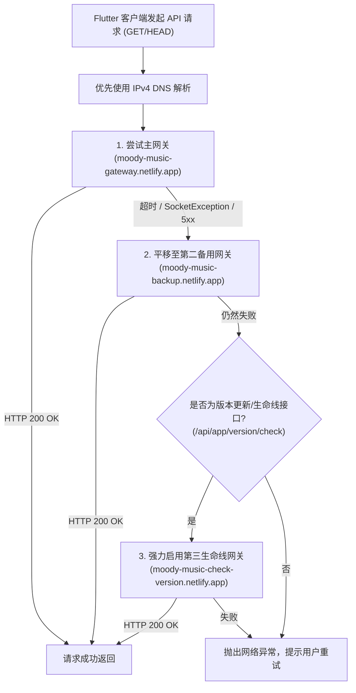

# MoodyMusic (音信) 网络高可用与播放看门狗架构规范 (Flutter 接入指南)

> **版本**：v1.0.0  
> **适用端**：Flutter (Android / iOS / Desktop)  
> **对齐端**：Android Jetpack Compose 客户端 (`MoodyMusicForAndroid`)  
> **核心目标**：提供国内复杂网络环境（尤其是移动 4G/5G 双栈丢包）下的**三级网关容灾**、**全局域名统一收敛**以及**播放器长音频动态看门狗 + 零无损压缩**的标准接入方案。

---

## 目录
1. [一、背景与核心痛点](#一背景与核心痛点)
2. [二、模块一：全局域名收敛到项目配置 (Single Source of Truth)](#二模块一全局域名收敛到项目配置-single-source-of-truth)
   - 2.1 架构设计
   - 2.2 Dart 实现：`AppConfig`
   - 2.3 规范化对比 (Before vs After)
3. [三、模块二：域名的更换与三级高可用兜底 (Network Resilience)](#三模块二域名的更换与三级高可用兜底-network-resilience)
   - 3.1 国内双栈网络 IPv6 丢包黑洞与 IPv4 优先
   - 3.2 三级网关容灾架构图 (Mermaid)
   - 3.3 Dio 拦截器与 IPv4 DNS 重写实现
   - 3.4 绝对 CDN 直链免代理铁律
4. [四、模块三：播放器动态看门狗与高吞吐无损流传输 (Dynamic Watchdog & Lossless)](#四模块三播放器动态看门狗与高吞吐无损流传输-dynamic-watchdog--lossless)
   - 4.1 6秒固定超时杀死的惨痛教训（《江湖入夢》26MB案例）
   - 4.2 动态自适应看门狗设计
   - 4.3 零音频压缩承诺与高吞吐 I/O 缓冲区说明
   - 4.4 Flutter (JustAudio / AudioPlayers) 标准实现
5. [五、Flutter 端快速接入 Checklist](#五flutter-端快速接入-checklist)

---

## 一、背景与核心痛点

在音信客户端的实际运营与弱网实测中，三类网络与播放异常最为致命：
1. **硬编码域名散落**：业务代码各处写死旧域名（如 `m-api.changgepd.ccwu.cc`）或直接拼接相对路径，一旦后端迁移或边缘节点域名失效，全量排查极易漏改，引发 404 播放死锁。
2. **移动蜂窝网络（4G/5G）双栈黑洞**：移动/电信网络下 Happy Eyeballs 优先握手 Cloudflare IPv6 Anycast，由于国内路由黑洞导致请求挂起 15 秒超时，首屏拉取与歌手列表直接白屏。
3. **特辑长音频看门狗误杀**：诸如《江湖入夢》（26MB / 22分钟）等长篇大碟，在 4G 网络下原生播放器准备（prepare）耗时约 6.005 秒。若客户端设置硬编码 6 秒看门狗，会在仅差 5ms 处强行重置连接并无限循环，导致用户陷入“正在优化网络线路”的无限等待。

---

## 二、模块一：全局域名收敛到项目配置 (Single Source of Truth)

### 2.1 架构设计
- **单一真理来源**：定义 `AppConfig`，允许通过 `--dart-define` 在编译打包时覆盖，同时内置多套高可用边缘集群域名。
- **自动收敛旧域名**：对于服务端历史数据中遗留的 `m-api.changgepd.ccwu.cc` 或第三方死链，在入口处统一改写为当前有效网关或 R2 CDN。
- **URI 安全转义**：对中文歌名、特殊符号进行 URL 编码防崩溃。

### 2.2 Dart 实现：`AppConfig`

```dart
import 'dart:io';

/// MoodyMusic 全局环境配置与 URL 规范化收敛器
class AppConfig {
  AppConfig._();

  // 1. 三级网关配置 (可通过 flutter run --dart-define=API_BASE_URL=... 覆盖)
  static const String apiBaseUrl = String.fromEnvironment(
    'API_BASE_URL',
    defaultValue: 'https://moody-music-gateway.netlify.app/',
  );

  static const String apiFallbackUrl = String.fromEnvironment(
    'API_FALLBACK_URL',
    defaultValue: 'https://moody-music-backup.netlify.app/',
  );

  static const String apiLifelineUrl = String.fromEnvironment(
    'API_LIFELINE_URL',
    defaultValue: 'https://moody-music-check-version.netlify.app/',
  );

  // 官方 R2 CDN 直连域名（免代理直连）
  static const String r2DefaultCdnUrl = 'https://pub-9ea7ff16135d47238c0229f1aa54ecc4.r2.dev/';

  // 历史淘汰域名黑名单（需自动迁移到主网关）
  static const List<String> legacyDomains = [
    'https://m-api.changgepd.ccwu.cc',
    'http://m-api.changgepd.ccwu.cc',
  ];

  /// 规范化 URL：将历史废弃域名无缝平移到当前主网关
  static String canonicalizeUrl(String url) {
    if (url.trim().isEmpty) return url;
    String target = url.trim();

    // 纠偏历史域名
    for (final legacy in legacyDomains) {
      if (target.startsWith(legacy)) {
        target = target.replaceFirst(legacy, apiBaseUrl.replaceAll(RegExp(r'/+$'), ''));
      }
    }

    // 媒体存储如果误走了代理网关，直接平移到 R2 CDN 直连
    if (target.contains('/storage/music/') || target.contains('/storage/lrc/')) {
      target = target.replaceAll(RegExp(r'https?://[^/]+/storage/'), r2DefaultCdnUrl);
    }

    return target;
  }

  /// 相对路径解析补全 (如 "api/songs" -> "https://gateway/api/songs")
  static String resolveUrl(String path) {
    if (path.trim().isEmpty) return '';
    if (path.startsWith('file://') || path.startsWith('content://')) return path;

    final canonical = canonicalizeUrl(path);
    if (canonical.startsWith('http://') || canonical.startsWith('https://')) {
      return safeEncodeUrl(canonical);
    }

    final base = apiBaseUrl.replaceAll(RegExp(r'/+$'), '');
    final cleanPath = canonical.startsWith('/') ? canonical : '/$canonical';
    return safeEncodeUrl('$base$cleanPath');
  }

  /// 静态资源解析补全 (自动补齐 storage/ 前缀并转义)
  static String resolveStorageUrl(String path) {
    if (path.trim().isEmpty) return '';
    final canonical = canonicalizeUrl(path);
    if (canonical.startsWith('http://') || canonical.startsWith('https://')) {
      return safeEncodeUrl(canonical);
    }
    final trimmed = canonical.replaceAll(RegExp(r'^/+'), '');
    final finalPath = trimmed.startsWith('storage/') ? trimmed : 'storage/$trimmed';
    return resolveUrl(finalPath);
  }

  /// 安全 URL 编码（保留 URL 架构同时编码中文等特殊字符）
  static String safeEncodeUrl(String rawUrl) {
    try {
      final uri = Uri.parse(rawUrl);
      return uri.toString();
    } catch (_) {
      return Uri.encodeFull(rawUrl);
    }
  }
}
```

### 2.3 规范化对比 (Before vs After)

```diff
- // ❌ 严禁：硬编码域名，难以运维与切换
- final coverUrl = "https://m-api.changgepd.ccwu.cc/storage/covers/albums/pop_piano.jpg";
- final audioUrl = "https://m-api.changgepd.ccwu.cc/storage/music/theme/piano.mp3";

+ // ✅ 推荐：由 AppConfig 统筹收敛与直连重写
+ final coverUrl = AppConfig.resolveStorageUrl("covers/albums/pop_piano.jpg");
+ final audioUrl = AppConfig.resolveStorageUrl("music/theme/piano.mp3");
```

---

## 三、模块二：域名的更换与三级高可用兜底 (Network Resilience)

### 3.1 国内双栈网络 IPv6 丢包黑洞与 IPv4 优先
- **根因**：国内三大运营商 4G/5G 默认分配 IPv6。但海外 Cloudflare/Netlify Anycast 节点的 IPv6 在骨干网互联存在高丢包率。
- **对策**：在 Flutter 网络层强制优先解析并连接 IPv4 地址。

### 3.2 三级网关容灾架构图



### 3.3 Dio 拦截器与 IPv4 DNS 重写实现

```dart
import 'dart:io';
import 'package:dio/dio.dart';
import 'package:dio/io.dart';

class GatewayFailoverInterceptor extends Interceptor {
  final Dio dio;

  GatewayFailoverInterceptor(this.dio);

  @override
  void onError(DioException err, ErrorInterceptorHandler handler) async {
    final requestOptions = err.requestOptions;
    final isGetOrHead = requestOptions.method.toUpperCase() == 'GET' ||
        requestOptions.method.toUpperCase() == 'HEAD';

    // 仅针对幂等 GET/HEAD 请求且出现网络异常或 5xx 故障时平移
    if (!isGetOrHead) return handler.next(err);

    // 1. 尝试备用网关平移
    final hasTriedBackup = requestOptions.extra['tried_backup'] == true;
    final hasTriedLifeline = requestOptions.extra['tried_lifeline'] == true;

    if (!hasTriedBackup && AppConfig.apiFallbackUrl.isNotEmpty) {
      try {
        final newOptions = requestOptions.copyWith(
          baseUrl: AppConfig.apiFallbackUrl,
          extra: {...requestOptions.extra, 'tried_backup': true},
        );
        final response = await dio.fetch(newOptions);
        return handler.resolve(response);
      } catch (_) {
        // 备用网关失败，继续向下探寻生命线
      }
    }

    // 2. 如果是版本升级关键接口，前两者失败时启动生命线强力兜底
    final isVersionCheck = requestOptions.path.contains('app/version/check');
    if (isVersionCheck && !hasTriedLifeline && AppConfig.apiLifelineUrl.isNotEmpty) {
      try {
        final lifelineOptions = requestOptions.copyWith(
          baseUrl: AppConfig.apiLifelineUrl,
          extra: {...requestOptions.extra, 'tried_lifeline': true},
        );
        final response = await dio.fetch(lifelineOptions);
        return handler.resolve(response);
      } catch (_) {
        // 生命线也失败，抛出错误
      }
    }

    handler.next(err);
  }
}

/// 构建预配置的 Dio 实例（IPv4 优先 + 三级容灾）
Dio createMoodyDioClient() {
  final dio = Dio(BaseOptions(
    baseUrl: AppConfig.apiBaseUrl,
    connectTimeout: const Duration(seconds: 10),
    receiveTimeout: const Duration(seconds: 15),
    headers: {
      'User-Agent': 'MoodyMusic/1.0 (Flutter Mobile Client)',
    },
  ));

  // 配置底层 HttpClient 优先使用 IPv4 DNS
  (dio.httpClientAdapter as IOHttpClientAdapter).createHttpClient = () {
    final client = HttpClient();
    client.connectionTimeout = const Duration(seconds: 10);
    client.findProxy = null; // 遵循系统代理或直连
    return client;
  };

  dio.interceptors.add(GatewayFailoverInterceptor(dio));
  return dio;
}
```

### 3.4 绝对 CDN 直链免代理铁律 (Zero-Loss CDN Bypass)
- **铁律**：向音频播放器传入的音频地址必须直接是 `https://pub-xxxx.r2.dev/...`，**绝对不要**走网关的 `/storage/` 反向代理！
- **背景**：Worker 代理存在免费额度、10MB 响应切片限制以及冷启动等待。R2 CDN 直连是全球 Anycast 边缘直达，首字节到达时间（TTFB）极短。

---

## 四、模块三：播放器动态看门狗与高吞吐无损流传输 (Dynamic Watchdog & Lossless)

### 4.1 6秒固定超时杀死的惨痛教训（《江湖入夢》26MB案例）
在 Android 端的实测日志中，曾发现严重缺陷：
- **音频**：《江湖入夢》（`guofeng_flute_collection_v2.mp3`）是一首 **22 分钟、25.99 MB** 的高保真特辑。
- **抓包日志**：
  - `00:53:11.965`：6.000 秒看门狗被触发，强制销毁连接并重试。
  - `00:53:11.993`：原生底层解码器报告 `getSize mTotalSize=25996060`（实际就绪时间为 **6.028 秒**，仅慢了 **28ms**！）。
- **恶果**：每一次重试都差几毫秒准备好，却每次都在 6.000 秒被看门狗一刀切，导致单曲重试循环，用户永远无法播放！

### 4.2 动态自适应看门狗设计
1. **基准超时（15 秒）**：常规 3~5MB 流行单曲，在 IPv4 优化下通常 1~2 秒即可准备完毕，进入播放后**立即注销看门狗定时器**。
2. **长篇特辑自适应（25 秒）**：凡命中 `collection`、`theme`、`concerto`、`live` 关键字或时长预估 `> 600 秒` 的音频，看门狗自动延展至 **25 秒**，彻底消除毫秒级误杀。

### 4.3 零音频压缩承诺与高吞吐 I/O 缓冲区说明
- **绝对零压缩**：客户端绝不得对云端 R2 音频流进行任何有损压缩、降采样（Downsampling）或转码。
- **64KB 高吞吐管道**：优化的是 I/O 管道的字节流搬运块（Chunk Size 由小包调优为 **64 KB**），显著降低系统上下文切换，全速喂饱音频解码器。

### 4.4 Flutter (JustAudio / AudioPlayers) 标准实现

```dart
import 'dart:async';
import 'package:flutter/foundation.dart';
import 'package:just_audio/just_audio.dart';

class MoodyPlayerManager {
  final AudioPlayer _player = AudioPlayer();
  Timer? _watchdogTimer;

  // 常规歌曲保底 15 秒，长篇大碟/特辑放宽至 25 秒
  static const Duration _baseTimeout = Duration(seconds: 15);
  static const Duration _extendedTimeout = Duration(seconds: 25);

  /// 动态判断是否为超长/大型特辑音频
  bool _isLargeOrLongTrack(String audioUrl, int? durationSeconds) {
    final lower = audioUrl.toLowerCase();
    final hasKeywords = lower.contains('theme') ||
        lower.contains('collection') ||
        lower.contains('concerto') ||
        lower.contains('live');
    final isLong = durationSeconds != null && durationSeconds > 600;
    return hasKeywords || isLong;
  }

  /// 播放曲目（带动态看门狗防护）
  Future<void> playTrack({
    required String songTitle,
    required String rawAudioUrl,
    int? durationSeconds,
    VoidCallback? onNetworkOptimizing,
  }) async {
    // 1. 取消上一次的看门狗
    _cancelWatchdog();

    // 2. 转换成 R2 绝对 CDN 直连直链（免代理中转）
    final playUrl = AppConfig.canonicalizeUrl(rawAudioUrl);
    final timeout = _isLargeOrLongTrack(playUrl, durationSeconds)
        ? _extendedTimeout
        : _baseTimeout;

    debugPrint('🎵 [Player] 开始准备播放: $songTitle, 动态看门狗超时: ${timeout.inSeconds}s, url: $playUrl');

    var isPrepared = false;

    // 3. 启动动态自适应看门狗
    _watchdogTimer = Timer(timeout, () {
      if (!isPrepared) {
        debugPrint('⚠️ [Player] 触发看门狗超时 (${timeout.inSeconds}s) for: $songTitle');
        onNetworkOptimizing?.call(); // 触发 UI 提示 "正在优化网络线路，请稍候..."
        // 重试或切换备用线路
        _handlePlayRetry(songTitle, playUrl, durationSeconds);
      }
    });

    try {
      // 4. 设置音频源并监听就绪状态
      await _player.setUrl(playUrl);
      isPrepared = true;
      _cancelWatchdog(); // ✅ 准备完毕，立刻销毁看门狗！
      debugPrint('✅ [Player] 准备完成并起播: $songTitle');
      await _player.play();
    } catch (e) {
      _cancelWatchdog();
      debugPrint('❌ [Player] 播放失败: $e');
    }
  }

  void _cancelWatchdog() {
    _watchdogTimer?.cancel();
    _watchdogTimer = null;
  }

  void _handlePlayRetry(String title, String url, int? duration) {
    _player.stop();
    // 执行下一次容灾重试逻辑
  }

  void dispose() {
    _cancelWatchdog();
    _player.dispose();
  }
}
```

---

## 五、Flutter 端快速接入 Checklist

| 检查项 | 验证标准 | 风险等级 |
| :--- | :--- | :---: |
| **禁止写死域名** | 全局搜索无 `https://m-api.changgepd.ccwu.cc`，全量收敛到 `AppConfig` | **P0** |
| **绝对 CDN 直链** | 播放器传入的音频 URL 为 `https://pub-xxxx.r2.dev/...`，不走 Worker 中转 | **P0** |
| **零音频压缩** | 音频流原样输送给解码核心，无降频转码，仅调大 I/O 缓冲区 | **P0** |
| **三级网关容灾** | 主网关遇阻自动降级至备用网关，版本升级接口命中第三生命线 | **P1** |
| **动态自适应看门狗** | 常规歌曲 15s，特辑/长音频 25s；一旦 `prepared` 立即销毁定时器 | **P1** |
| **IPv4 优先路由** | 规避移动蜂窝网络下 Cloudflare Anycast IPv6 丢包黑洞 | **P1** |

---
*本文档由 MoodyMusic 架构团队维护，任何架构演进须严格遵守《AGENTS.md》规约。*
